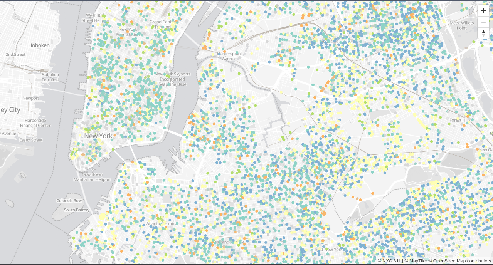

# Observe your users map browsing

## Introduction

So you have an application that offers to your users a map interface. You want to allow them to render thousands of elements so you decide to go through the modern route rendering tiles. But, what are those tiles? Well, long time ago Google defined a clever way to grid the world so it is easy to render and cache.

<br/>
_Source: [Maptiler](https://www.maptiler.com/google-maps-coordinates-tile-bounds-projection/#2/27.77/63.39)_


Rendering your data using this definition is very convenient because it provides several benefits:

* You can split the data in small chunks that can render progressively on the browser
* You can leverage your browser cache to save bandwidth
* When zooming in, you can render previous tiles until you get the data to avoid a blank screen

Additionally, you can serve your tiles in two formats: as raster images (`PNG` or `JPEG` for example) or as raw vector data. The first is necessary for example for imagery, but if you are working with vector data (points, polygons) you probably want to use vector tiles to:

* Avoid server image rendering, usually being faster to dispatch
* Allow dynamic styles on the browser, for example allowing labels in multiple languages, or switching between different color palettes

----

You may even use want to Elasticsearch to store your business data, **and** to directly generate your vector tiles through the [`_mvt`](https://www.elastic.co/guide/en/elasticsearch/reference/current/search-vector-tile-api.html) API endpoint ([blog post](https://www.elastic.co/blog/introducing-elasticsearch-vector-tile-search-api-for-geospatial) with more details)

----

OK so now that I've convinced you to use this approach there's even a quite interesting additional benefit.

A [tiled web map](https://en.wikipedia.org/wiki/Tiled_web_map) is usually served using a URL pattern that exposes the zoom, x, and y coordinates. For example, OpenStreetMap serves raster tiles at `https://tile.openstreetmap.org/${z}/${x}/${y}.png` and Maptiler serves vector tiles at something like `https://api.maptiler.com/tiles/v3/{z}/{x}/{y}.pbf?key={yourapikey}`.

Those coordinates can easily be converted back to a latitude and longitude so it's possible to observe the logs of your map to learn **where** your users are browsing!

## A minimal application

To illustrate this scenario I modified Thomas Neirynck [MVT sample](https://github.com/thomasneirynck/mvt_sample) to publish the simplest webmapping application backed by Elasticsearh and rendered on the browser with [Maplibre](https://maplibre.org/) that renders a full month of [NYC 311](https://portal.311.nyc.gov/) data.

<br/>
_Screenshot of a NYC map with 311 as markers_

The app is made by just two files:

* [`index.js`](https://github.com/jsanz/nyc311-demo/blob/main/src/index.js) is a node back-end that connects to Elasticsearch and exposes the NYC 311 dataset constrained to a single month, querying not only the geometries but also the complaint type, dates, agency, and resolution description.
* [`index.html`](https://github.com/jsanz/nyc311-demo/blob/main/src/index.html) just renders the layer on top of a basic basemap using color to differentiate the most common complaint types. It would be easy to add more features like pop ups, complaint switcher, etc but I preferred to keep the website simple and easy to follow.

This application is exposed through a reverse proxy with [Nginx](https://www.nginx.com/) without any additional configuration.


## Deploying Elastic Agent

With Elastic Agent and Fleet is incredibly easy to manage the observability of your infrastructure. I'm definitely not an expert on this field and yet, it was easy to just follow the [documentation](https://www.elastic.co/guide/en/fleet/current/install-fleet-managed-elastic-agent.html) to deploy an agent on my server and create a policy to start gathering metrics and logs from both the whole system and the nginx web server. I only had to download and install the agent once and the rest of the configuration was done from the Kibana interface.

No more beats YAML editing!

<br/>
_Screenshot of the Agent policy with the System and Nginx integrations_


## Ingest pipeline to convert tile coordinates into a latitude and longitude

Now that we are getting web server logs into our cluster is time to enrich our documents with the zoom and the center of the tile requests.

To do this first I defined an ingest pipeline that will have three processors:

1. Extract the `x`, `y`, and `z` numeric fields using the [Grok language](https://www.elastic.co/guide/en/elasticsearch/reference/current/grok-processor.html). This should be adapted to each web server
2. A second processor will convert those three figures into a latitude and longitude and store both the zoom as an integer, and the center of the tile as a `geo_point`.  Formulas to do the conversion are available at the [OpenStreetMap wiki](https://wiki.openstreetmap.org/wiki/Slippy_map_tilenames).
3. Remove the fields from the first step


```
PUT _ingest/pipeline/add_center_and_zoom_fields
{
  "description": "Compute zoom and center for tile requests ",
  "processors": [
    {
      "grok": {
        "field": "url.original",
        "patterns": [
          "/tile/%{NUMBER:tile.z}/%{NUMBER:tile.x}/%{NUMBER:tile.y}"
        ],
        "if": "ctx?.url?.original.startsWith('/tile')",
        "ignore_failure": true
      }
    },
    {
      "script": {
        "source": """
          def x = Double.parseDouble(ctx.tile.x);
          def y = Double.parseDouble(ctx.tile.y);
          def z = Double.parseDouble(ctx.tile.z);
          
          def lat = (x/Math.pow(2,z)*360-180);
          def n = Math.PI-2*Math.PI*y/Math.pow(2,z);
          def lon = (180/Math.PI*Math.atan(0.5*(Math.exp(n)-Math.exp(-n))));
          
          ctx['url.center'] = [ lat, lon ];
          ctx['url.zoom'] = z
          """,
        "if": """ctx?.tile?.x !== null && ctx?.tile?.y !== null && ctx?.tile?.z !== null""",
        "description": "Defines url.center from tile coordinates"
      }
    },
    {
      "remove": {
        "field": [
          "tile.x",
          "tile.y",
          "tile.z"
        ],
        "ignore_missing": true,
        "if": "ctx?.tile?.x !== null && ctx?.tile?.y !== null && ctx?.tile?.z !== null",
        "ignore_failure": true
      }
    }
  ]
}
```

## Customize the nginx integration

With the ingest pipeline ready the easiest part is to modify the Fleet nginx integration to include a custom pipeline and a custom index mapping to process our logs. The mappings are necessary because geo_points are no automatically typed in Elasticsearch, so they need to be declared explicitly.

The full process is covered in this fantastic [tutorial](https://www.elastic.co/guide/en/fleet/master/data-streams-pipeline-tutorial.html) from the Fleet documentation.


## Visualize in Kibana Dashboards

Now that your logs include also details on the geospatial location of your users wanderings it is time to include that information in the Nginx dashboards to learn not only where your users are, but also what they browse. One way to visualize this is to group logs by zoom level and aggregate to render the count of records for low, mid, and high zoom level, getting the areas that may interest more our users.


This is just the beginning. The next obvious step is to think on what business rules could be unlocked by this new angle to our obseravibilty set up. I can think for example:

* Would it be interesting to trigger alerts when users browse certain areas at high zoom levels?
* What about of monthly reports of the map browsing at different zoom levels to track hot areas?
