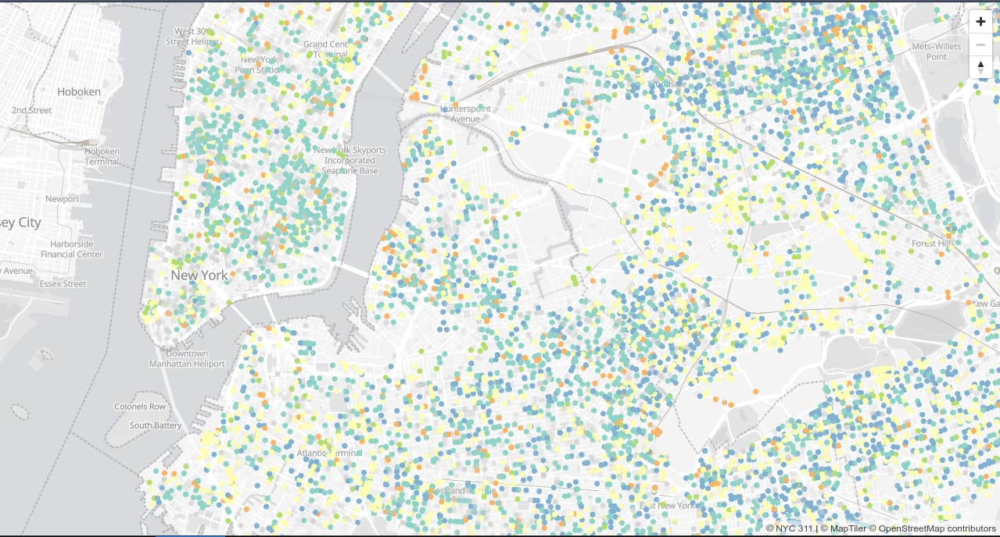
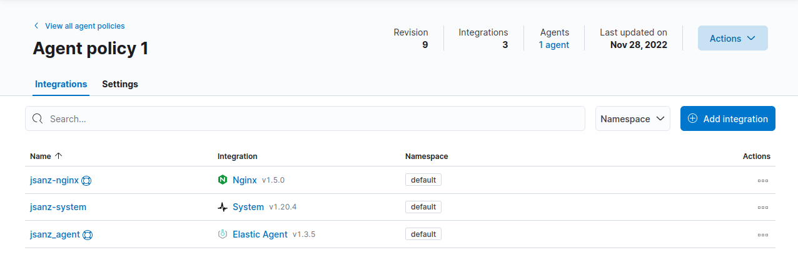
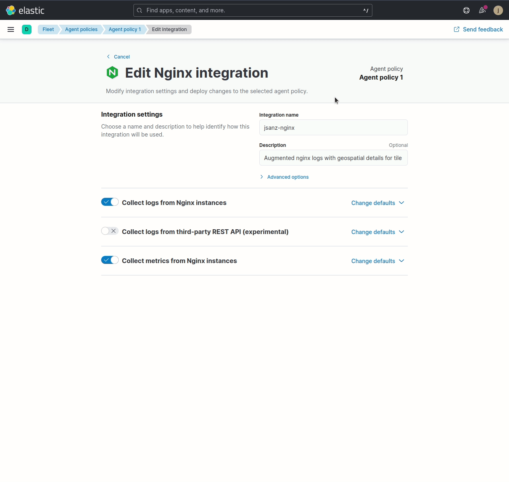

# Get insights from your webmapping application with Ingest Pipelines and Elastic Observability


## Introduction

Imagine you have an application that offers a map interface that should render thousands of elements, so you learn you must go through the modern route of generating tiles. But what are those tiles? Well, long ago, [Google defined](https://en.wikipedia.org/wiki/Web_Mercator_projection) a clever way to represent and grid the world, making it easy to render and cache.

Sending your data to your application with this predefined grid is very convenient and provides several benefits:

* You can split the data into small chunks that can render progressively on the browser
* You can leverage your browser cache to save bandwidth
* When zooming in, you can show previous tiles until you get the new data avoiding a blank screen

<br/>
_Source: [Maptiler](https://www.maptiler.com/google-maps-coordinates-tile-bounds-projection/#2/27.77/63.39)_

You can also serve your tiles in two formats: raster images (`PNG`, `JPEG`, ...) or raw vector data. The first is necessary for example for imagery, but if you are working with vector data (points, polygons), you probably want to use vector tiles to:

* Avoid rendering images on your server
* Allow dynamic styles on the browser enables cool features like allowing labels in multiple languages or switching between different color palettes or themes

----

You may even want Elasticsearch to store your business data, **and** to directly generate your vector tiles through the [`_mvt`](https://www.elastic.co/guide/en/elasticsearch/reference/current/search-vector-tile-api.html) API endpoint ([blog post](https://www.elastic.co/blog/introducing-elasticsearch-vector-tile-search-api-for-geospatial) with more details).

----

OK, now that you are convinced to use this approach, there's even a pretty interesting additional benefit.

A [tiled web map](https://en.wikipedia.org/wiki/Tiled_web_map) is served using a URL pattern that exposes the `zoom`, `x`, and `y` coordinates. For example, OpenStreetMap serves raster tiles at `https://tile.openstreetmap.org/${z}/${x}/${y}.png` and Maptiler serves vector tiles at `https://api.maptiler.com/tiles/v3/{z}/{x}/{y}.pbf?key={yourapikey}`.

Those tile coordinates are very easy to convert back to pairs of latitudes and longitudes. This means that tiled maps enable you to observe the logs of your map to learn **where** your users are browsing!

## A minimal application

To illustrate this scenario, I modified Thomas Neirynck [MVT sample](https://github.com/thomasneirynck/mvt_sample) to publish the most straightforward [webmapping application](https://github.com/jsanz/nyc311-demo) backed by Elasticsearch and yielded on the browser with [MapLibre](https://maplibre.org/), showing an entire month of [NYC 311](https://portal.311.nyc.gov/) data.

<br/>
_Screenshot of an NYC map with the location of 311 calls as markers_

Just two files make the app:

* [`index.js`](https://github.com/jsanz/nyc311-demo/blob/main/src/index.js) is a node backend that connects to Elasticsearch. It exposes the NYC 311 dataset constrained to a single month, querying the geometries, complaint type, dates, agency, and resolution description.
* [`index.html`](https://github.com/jsanz/nyc311-demo/blob/main/src/index.html) renders the layer on top of a basic basemap using color to differentiate the most common complaint types. Adding more features like pop-ups or a complaint switcher would be easy, but I preferred keeping the website simple and easy to follow.

Finally, this application is exposed through a reverse proxy with [Nginx](https://www.nginx.com/) without any additional configuration.


## Deploying Elastic Agent

[Elastic Agent](https://www.elastic.co/elastic-agent) and [Fleet](https://www.elastic.co/guide/en/fleet/current/fleet-overview.html) make it incredibly easy to manage the observability of your infrastructure. I'm not an expert in this field, yet it was easy to follow the [documentation](https://www.elastic.co/guide/en/fleet/current/install-fleet-managed-elastic-agent.html) to deploy an agent on my server and create a policy to start gathering metrics and logs from both the whole system and the Nginx web server. I only had to download and install the agent once and use Kibana for the rest of the configuration.

Yeah, no more YAML editing for your beats! 🥳

<br/>
_Screenshot of the Agent policy with the System and Nginx integrations_

## Ingest pipeline to convert tile coordinates into a latitude and longitude

Now that we are getting web server logs into our cluster is time to enrich our documents with zoom and the center of the tile requests.

To do this, first, I defined an [ingest pipeline](https://www.elastic.co/guide/en/elasticsearch/reference/master/ingest.html) that will have three processors:

1. Extract the `x`, `y`, and `z` numeric fields using the [Grok language](https://www.elastic.co/guide/en/elasticsearch/reference/current/grok-processor.html). This pattern is specific to my server and needs tweaking for each scenario.
2. Next a [script processor](https://www.elastic.co/guide/en/elasticsearch/reference/master/script-processor.html) will convert the three figures into a latitude and longitude. Then it will store the zoom as an integer and the center of the tile as a `geo_point`. Formulas to do the conversion are available at the [OpenStreetMap wiki](https://wiki.openstreetmap.org/wiki/Slippy_map_tilenames).
3. Finally, [remove](https://www.elastic.co/guide/en/elasticsearch/reference/master/remove-processor.html) the fields from the first step.

From the Kibana DevTools:

```
PUT _ingest/pipeline/add_center_and_zoom_fields
{
  "description": "Compute zoom and center for tile requests ",
  "processors": [
    {
      "grok": {
        "description": "Extracts tile coordinates from request URL"
        "field": "url.original",
        "patterns": [
          "/tile/%{NUMBER:tile.z}/%{NUMBER:tile.x}/%{NUMBER:tile.y}"
        ],
        "if": "ctx?.url?.original.startsWith('/tile')",
        "ignore_failure": true
      }
    },
    {
      "script": {
        "description": "Defines url.center from tile coordinates"
        "source": """
          def x = Double.parseDouble(ctx.tile.x) + 0.5;
          def y = Double.parseDouble(ctx.tile.y) + 0.5;
          def z = Double.parseDouble(ctx.tile.z);
          
          def lon = (x/Math.pow(2,z)*360-180);

          def n = Math.PI-2*Math.PI*y/Math.pow(2,z);
          def lat = (180/Math.PI*Math.atan(0.5*(Math.exp(n)-Math.exp(-n))));
          
          ctx['url']['center'] = [ lon, lat ];
          ctx['url']['zoom'] = z
          """,
        "if": """ctx?.tile?.x !== null && ctx?.tile?.y !== null && ctx?.tile?.z !== null""",
        "ignore_failure": true
      }
    },
    {
      "remove": {
        "description": "Removes tile coordinates"
        "field": [
          "tile.x",
          "tile.y",
          "tile.z"
        ],
        "if": "ctx?.tile?.x !== null && ctx?.tile?.y !== null && ctx?.tile?.z !== null",
        "ignore_failure": true
      }
    }
  ]
}
```

## Customize the Nginx integration

With the ingest pipeline ready, the easiest part is to modify the Fleet [Nginx integration](https://docs.elastic.co/en/integrations/nginx) to include a custom pipeline and a custom index mapping to process our logs. The mappings are necessary because Elasticsearch does not automatically type [geopoints](https://www.elastic.co/guide/en/elasticsearch/reference/current/geo-point.html) and must be declared explicitly.

This fantastic [tutorial](https://www.elastic.co/guide/en/fleet/master/data-streams-pipeline-tutorial.html) from the Fleet documentation covers the whole process.

<br/>
_A custom pipeline and mappings for our Nginx integration_

## Visualize in Kibana Dashboards

Now that logs also include details on the geospatial location of your user's wanderings through the application map, it is time to include that information in the Nginx dashboards to learn where your users are **and** what they browse. One way to visualize this is to create a map and create layers, grouping logs by zoom level. Each layer aggregates tile requests to render the count of records for low, mid, and high zoom levels, getting the areas that may interest our users more.

<br/>
_Browsing our users visits to our map for low and high zoom levels_

But gathering data is just the beginning. The next step is considering how this new angle could unlock business rules to our observability setup. I can think, for example:

* Is it interesting to trigger alerts when users browse certain areas at high zoom levels?
* Do I need monthly reports of the map browsing at different zoom levels to track hot areas?
* What about drilling down the visits to those areas by other dimensions like device or requests [geoip](https://www.elastic.co/blog/geoip-in-the-elastic-stack) location?
* Is it interesting for a security investigation to trace the areas our users browse on our application?

What do you think? Could you guess other cool use cases for this log data? 🤔

----

💙 Special thanks to @nickpeihl for the thorough ingest pipeline code review and suggestions.

----